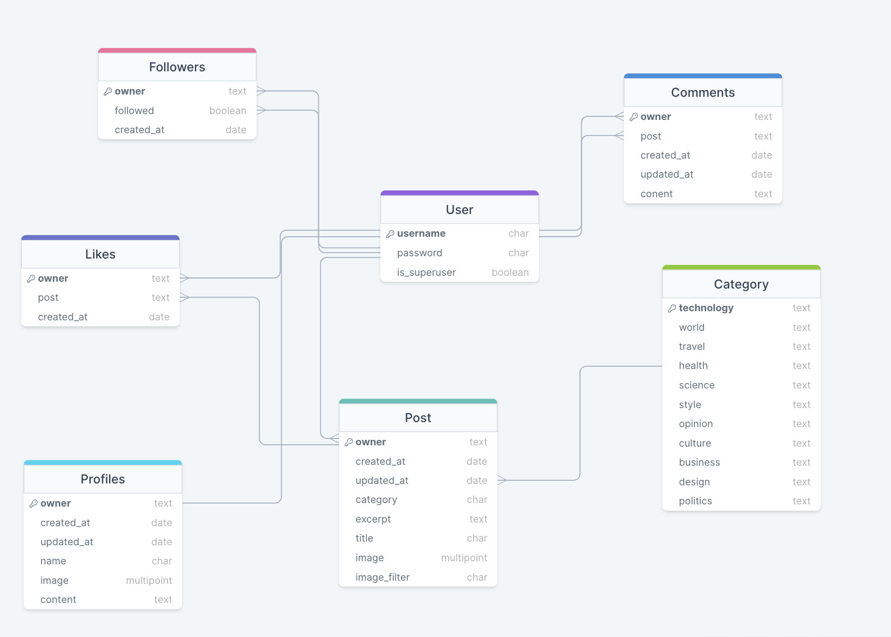

# Catch-Up

Catch-Up is an innovative blogging platform where users can effortlessly share their experiences, reviews, and thoughts through text, images, and video links. The application is designed to categorize blogs for seamless navigation, offering a personalized and engaging user experience. Developed using Django REST Framework for the backend and React Js for the frontend, Catch-Up promises a responsive and contemporary user interface.

The essence of Catch-Up lies in its user-centric approach, encouraging users to freely express their thoughts on various subjects. Whether it's an adventure in a new country, a critique of the latest tech gadget, a fitness video tutorial, or daily musings, Catch-Up is the perfect space for sharing. Users can also follow others, like their posts, and keep themselves updated with the latest blogs in their interest areas.

The platform's intuitive design allows users to easily navigate through categories, find interesting blogs, or discover new content. When no posts are available in a category, a friendly message guides the user back to the plethora of other content.

Catch-Up also features detailed user profiles, showcasing the blogger's interests, number of followers, and their blogging journey. Each profile is a window into the user's world, with every blog they've posted available for readers to explore and enjoy.

For a detailed guide on the backend API of Catch-Up, please refer to our comprehensive documentation. To learn more about the React frontend, click [here](https://github.com/gassama94/drf-api).

**Live Demo:** [Catch-Up Blogging Platform](https://catchupp-c89883ca1862.herokuapp.com/)

## Contents

- [Catch-Up Overview](#catch-up)
  * [Conceptualization](#conceptualization)
  * [Data Structure](#data-structure)
    + [Blog Post](#blog-post)
    + [Blog Categories](#blog-categories)
    + [User Comments](#user-comments)
    + [User Connections](#user-connections)
    + [Post Reactions](#post-reactions)
    + [User Profiles](#user-profiles)
  * [API Routes](#api-routes)
  * [Technologies Stack and Dependencies](#technologies-stack-and-dependencies)
  * [Quality Assurance](#quality-assurance)
    + [Hands-on Testing](#hands-on-testing)
    + [Automated Checks](#automated-checks)
  * [Code Standards](#code-standards)
  * [Addressed Issues](#addressed-issues)
  * [Pending Challenges](#pending-challenges)
  * [Project Deployment](#project-deployment)
  * [Acknowledgments](#acknowledgments)

Generated with [TOC Generator](https://ecotrust-canada.github.io/markdown-toc/)

## Conceptualization

The journey of Catch-Up began with crafting user stories to define the functionality and aesthetic of the platform. By questioning what users would expect and desire from a blogging site, I could pinpoint the necessary features and design elements to incorporate.

## Data Structure

For data structure visualization, I used [DrawSQL](https://drawsql.app/) to create an organized and clear representation of the database schema, illustrating the interconnections between various data tables.

Below are the custom data models tailored for Catch-Up:

### Blog Post

Given that Catch-Up is primarily a blogging platform, the blog post model was customized to accommodate full-length blogs with embedded images and video URLs. Essential fields like 'excerpt' and 'category' were included to enhance the structure of each post.

### Blog Categories

To facilitate blog sorting, a dedicated 'Categories' model was implemented. This model connects to the blog posts, enabling each post to be associated with a specific category. The model was designed for simplicity and ease of integration.

### User Comments

The 'Comments' model allows users to engage with blog posts, providing spaces for posting, editing, and deleting comments. This interaction is vital for a lively community experience on the platform.

### User Connections

The 'Followers' model tracks the connections between users, defining who follows whom. This feature enriches the social aspect of Catch-Up, allowing users to cultivate their own community within the platform.

### Post Reactions

The 'Likes' model lets users express their appreciation for posts. This simple yet impactful feature enhances user interaction and provides valuable feedback to bloggers.

### User Profiles

Each user's profile on Catch-Up is detailed with personal information, including a bio, avatar, and blogging history. This personal touch adds depth to the user experience and fosters a sense of community.

## API Routes

The table below outlines the various API endpoints and their corresponding functions:

| **Endpoint**           | **Description**                                                                                   | **Method** | **Operation**       | **Type**   |
|------------------------|---------------------------------------------------------------------------------------------------|------------|---------------------|------------|
| **Endpoints for Comments** |                                                                                                   |            |                     |            |
| api/comments/          | Gathers all comments made by a user on a selected post                                           | GET        | Read                | List       |
| api/comments/id/       | Allows modification or removal of a user's comment based on its unique ID and ownership or admin rights | PUT        | Update/Delete       | Detail     |
| **Endpoints for Followers** |                                                                                                   |            |                     |            |
| api/followers/         | Displays a list of all follower relationships, showing who follows whom                          | GET        | Read                | List       |
| api/followers/id/      | Fetches or erases a specific follower connection based on ID, applicable to the profile owner    | GET/DELETE | Read/Delete         | Detail     |
| **Endpoints for Likes** |                                                                                                   |            |                     |            |
| api/likes/             | Lists all posts liked by a user                                                                   | GET        | Read                | List       |
| api/likes/id/          | Removes a like from a post, identified by ID, if executed by the like owner                       | DELETE     | Delete              | Detail     |
| **Endpoints for Posts** |                                                                                                   |            |                     |            |
| api/posts/             | Lists all posts, focusing on those liked by the user                                              | GET        | Read                | List       |
| api/posts/id/          | Provides, alters, or removes a post contingent on ID and user's ownership or administrative status | PUT        | Update/Delete       | Detail     |
| **Endpoints for Profiles** |                                                                                                   |            |                     |            |
| api/profiles/          | Enumerates all created user profiles                                                              | GET        | Read                | List       |
| api/profiles/id/       | Retrieves, modifies, or deletes a user profile based on ID and ownership                          | PUT        | Update/Delete       | Detail     |
| **Endpoints for Categories** |                                                                                                   |            |                     |            |
| api/category/          | Enumerates all posts by category and allows for new post creation                                 | GET/POST   | Create/Read         | List       |

## Technology Stack and Dependencies

Catch-Up leverages the power and flexibility of Django and Django Rest Framework for its core development. This foundation is augmented with a variety of additional libraries and tools to enhance functionality and user experience:

- **django-cors-headers**: An essential Django application, it integrates Cross-Origin Resource Sharing (CORS) headers into server responses. This feature is crucial for allowing the API to handle requests from various origins, not limited to its own host. More details can be found [here](https://pypi.org/project/django-cors-headers/).

- **django-cloudinary-storage**: This tool is integrated for seamless image management, enabling the storage of user profile images on Cloudinary. This implementation ensures efficient and reliable image handling. Discover more at [django-cloudinary-storage](https://pypi.org/project/django-cloudinary-storage/).

- **dj-rest-auth**: It provides a set of REST API endpoints for authentication processes including login and logout operations, simplifying the authentication flow within the application. For further information, visit [dj-rest-auth](https://dj-rest-auth.readthedocs.io/en/latest/introduction.html).

- **djangorestframework-simplejwt**: This library offers JSON Web Token authentication, adding an extra layer of security for the API. It ensures safe and secure user authentication. Learn more [here](https://django-rest-framework-simplejwt.readthedocs.io/en/latest/).

- **django-filter**: Utilized for its powerful filtering capabilities, especially in implementing ISO DateTime filtering for events' GET endpoints. This allows the application to efficiently handle date range queries. More on this can be found at [django-filter](https://django-filter.readthedocs.io/en/stable/).

- **dj-database-url**: This library plays a critical role in configuring database connections through environment variables, thus streamlining the database setup process. It is particularly effective for managing different environments. Additional information is available [here](https://pypi.org/project/dj-database-url/).

- **psychopg2**: As a database adapter, it facilitates interactions between Python and PostgreSQL databases, ensuring smooth data handling and operations. More details can be found at [psychopg2](https://pypi.org/project/psycopg2/).

- **I Am Responsive**: This is a tool that I used to ensure that the website is well-optimized for various devices. This tool helps in visually confirming that the website adapts to different screen sizes, which is crucial for a good user experience across smartphones, tablets, and desktops. More details can be found at [I Am Responsive](http://ami.responsivedesign.is/) 

- **Coolors**:  For color scheme creation and ensuring good color contrast,  This tool is extremely helpful for designing an accessible and visually appealing interface. It provides a simple and effective way to check and create color contrasts and palettes.  [Coolors](https://coolors.co/).

- **Axios** : Used for making HTTP requests. [Axios](https://axios-http.com/)
- **FontAwesome**: Provides icons used in the project. [FontAwesome](https://fontawesome.com/)
- **Cloudinary**: Hosts user profile images. [Cloudinary](https://cloudinary.com/)

Each of these tools and libraries has been carefully selected to ensure that Catch-Up delivers a robust, secure, and efficient user experience, aligning with the latest industry standards.

## Quality Assurance

### Hands-on Testing

I conducted extensive manual testing to ensure each API endpoint functioned as intended. This process involved using both the local server interface and the deployed database.

### Automated Checks

Automated tests were implemented to further validate the functionality, particularly for post creation and management. These tests, found in the `tests.py` file, simulate various user interactions and check for expected outcomes.

## Code Standards

All Python code was validated using the [CI Python Linter](https://pep8ci.herokuapp.com/) to ensure adherence to best practices and coding standards.

## Addressed Issues

During development, several challenges were overcome, including:

- **Category Selection Bug**: Resolved by aligning frontend selection options with backend category values.
- **Database Migration Hurdles**: Addressed by resetting and properly migrating the database.
- **CSRF Token Issue**: Solved by adjusting the development environment settings.

- **Avatar Image Display Issue**: Initially, the Avatar component was not displaying images correctly in certain contexts. This issue was addressed by:

  1. **Ensuring Correct Image Path**: Verified and corrected the image source paths to ensure they were accurate and accessible, both in development and production environments.

  2. **Implementing Fallback Mechanism**: Enhanced the Avatar component to include a fallback mechanism. When the primary image source fails (e.g., due to a broken link or if the image is not yet set for a new user), the component now defaults to a predefined image, ensuring that a user avatar is always displayed.

  3. **Integration with React-Bootstrap Styles**: To maintain visual consistency with the rest of the application, the Avatar component was adapted to include React-Bootstrap's styling classes, ensuring that it aligns with the overall look and feel of the application.

  4. **Testing and Validation**: Conducted thorough testing across different scenarios (valid image URL, invalid URL, no URL) to confirm the robustness of the Avatar component in handling image display and fallbacks.

## Pending Challenges

Currently, there are no unresolved issues in Catch-Up.

## Project Deployment

This guide will help you deploy the Bloggerize API to Heroku using a Postgres database through ElephantSQL and Cloudinary for hosting user profile images.

## Steps for Deployment

### 1. Fork or Clone Repository
- Fork or clone this repository from GitHub.

### 2. Set Up Cloudinary
- Create a [Cloudinary account](https://cloudinary.com/users/register/free) for hosting user profile images.
- Login to Cloudinary and select the 'Dashboard'.
- Copy the 'API Environment variable' value starting from `cloudinary://`. You may need to select the eye icon to view the full environment variable.

### 3. Heroku Setup
- Login to [Heroku](https://www.heroku.com/).
- Select 'Create new app' from the 'New' menu at the top right.
- Enter an app name and select the appropriate region.
- Click 'Create app'.

### 4. ElephantSQL Database Setup
- Login to [ElephantSQL](https://www.elephantsql.com/).
- Click 'Create new instance'.
- Name the plan and select the 'Tiny Turtle (free)' plan.
- Choose the nearest data center to your location.
- Click 'Review'.
- In the ElephantSQL dashboard, click on the database instance name for this project.
- Copy the ElephantSQL database URL (starts with `postgres://`).

### 5. Configuring Heroku
- In the Heroku dashboard, select the 'Settings' tab.
- Under 'Config Vars', click 'Reveal Config Vars'.
- Enter the following:
  - `CLOUDINARY_URL`: Your Cloudinary URL.
  - `DATABASE_URL`: Your ElephantSQL Postgres database URL.
  - `SECRET_KEY`: A secret key of your choice.
  - `ALLOWED_HOST`: The URL of your Heroku app (without `https://`).

### 6. Deployment from GitHub
- In Heroku, select the 'Deploy' tab.
- Choose 'GitHub' as the deployment method and link your GitHub repository.
- Under 'Manual Deploy', choose the 'main' branch and click 'Deploy Branch'.

## Acknowledgments

I extend my gratitude to various sources that inspired and guided the development of Catch-Up:

- Example data models and blog structures from diverse online resources.
- The Code Institute's Moments app tutorial for foundational learning.
- My mentor, celestine okoro for invaluable insights and guidance.
- The vibrant community on Slack for their support, feedback, and collaborative spirit.
- ChatGPT by OpenAI for providing assistance with coding challenges and offering instant support.
- Fellow students who shared their experiences, challenges, and solutions, contributing to a rich learning environment.

---

This addition to your README acknowledges the broad range of support and inspiration you received throughout the development of your project. It not only highlights professional guidance but also the value of community and AI tools in the learning and development process.

For further details, please refer to the gassamasaikou@yahoo.com.